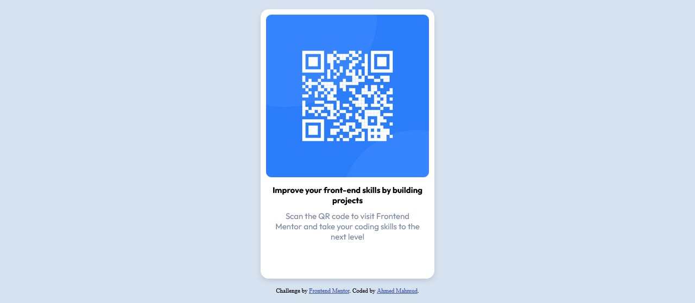
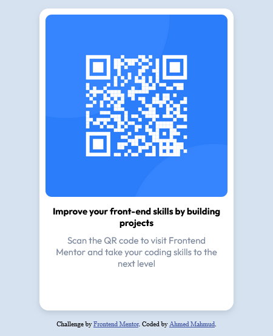

# Frontend Mentor - QR code component solution

This is a solution to the [QR code component challenge on Frontend Mentor](https://www.frontendmentor.io/challenges/qr-code-component-iux_sIO_H). Frontend Mentor challenges help you improve your coding skills by building realistic projects.

## Table of contents

- [Frontend Mentor - QR code component solution](#frontend-mentor---qr-code-component-solution)
  - [Table of contents](#table-of-contents)
  - [Overview](#overview)
    - [Screenshot](#screenshot)
    - [Links](#links)
  - [My process](#my-process)
    - [Built with](#built-with)
    - [What I learned](#what-i-learned)
    - [Continued development](#continued-development)
    - [Useful resources](#useful-resources)
  - [Author](#author)
  - [Acknowledgments](#acknowledgments)

## Overview

### Screenshot





### Links

- Solution URL: [Github](https://github.com/dDevAhmed/QR_Code_Component)
- Live Site URL: [Github Pages](https://ddevahmed.github.io/QR_Code_Component/)

## My process

### Built with

- Semantic HTML5 markup
- CSS custom properties
- Flexbox
- Mobile-first workflow

### What I learned

While working on this project, I learned the following:

- How to work with Google Fonts to enhance typography.
- Revisiting and refining my understanding of media queries for responsive design.
- Utilizing Flexbox for creating flexible and responsive layouts.

```css
body {
    background-color: var(--Light-gray);
    height: 100vh;
    margin: 0;
    overflow-x: hidden;
    display: flex;
    flex-direction: column;
    justify-content: center;
    align-items: center;
    gap: 15px;
    font-size: 15px;
}
```

Using Flexbox properties like justify-content and align-items makes it easy to center elements without relying on position properties.

### Continued development

As I continue to learn more about front-end development, I plan to improve this project by:

- Adding more advanced CSS techniques.
- Experimenting with CSS Grid for layout.
- Enhancing accessibility features.

### Useful resources

- [W3Schools](https://www.w3schools.com/) - Great resource for revisiting basic concepts and getting quick references.
- [ChatGPT](https://www.google.com/url?sa=t&source=web&rct=j&opi=89978449&url=https://chat.openai.com/&ved=2ahUKEwi4pJXa25qGAxVwWEEAHUJBACEQFnoECAYQAQ&usg=AOvVaw139HWUX4D802zbDuJCdFg9) - Helpful for generating code snippets and getting explanations.

## Author

- Website - [Ahmed Mahmud](https://ddevahmed.github.io/)
- Frontend Mentor - [@dDevAhmed](https://www.frontendmentor.io/profile/dDevAhmed)
- Twitter - [@dDevAhmed](https://x.com/dDevAhmed)

## Acknowledgments

I'd like to thank the following:

- [Frontend Mentor](https://www.frontendmentor.io/) for providing this challenge and the resources.
- The challenge author [Frontend Mentor](https://www.frontendmentor.io/), for designing this project.
- My friends and family for their support and encouragement.

By working on this challenge, I have significantly improved my front-end skills and gained more confidence in building responsive web components.
